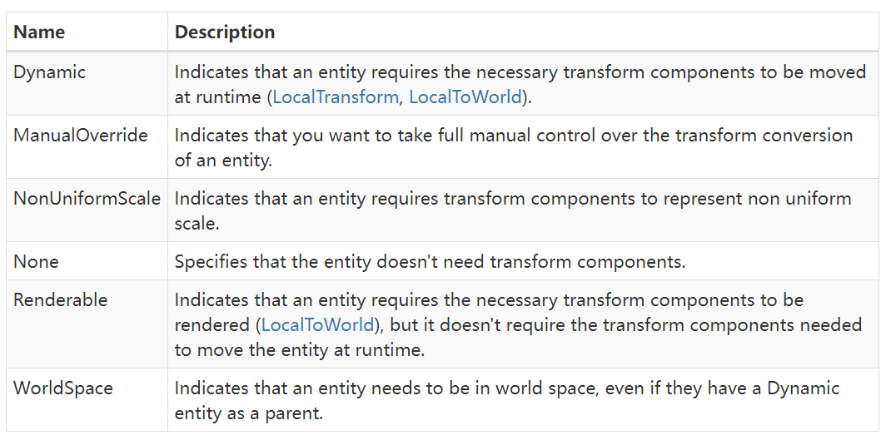

# 哪些Components拥有类似GameObject Transform组件的值

在DOTS技术栈下，LocalToWorld Component 和 LocalTransform Component具有类似GameObject Transform组件的数据。

但是似乎LocalToWorld的访问权限更多是推荐readonly。 而如果想对常规类似Position，Rotation，Scale等值的修改/更新，则是推荐使用LocalTransform。

## 如何访问LocalTransform组件

当在Subscene中将一个GameObject转化为 Entity的时候我们会发现，在Enity默认的Component preview窗口里是没有LocalTransform这个Component的。获取LocalTransform Component 需要手动添加。

通常在实现自定义Baker的时候需要回去Entity，同时（根据最新版（1.0.16 截至2023/12/25）的API文档要求）指定TransformUsageFlags的枚举类型为Dynamic。==默认给予TransformUsageFlags的值的API都要淘汰了==

`TransformUsageFlags.Dynamic`
意味着这个Entity需要被移动，会为Entity添加LocalToWorld 以及 LocalTransform 两个Components。
下面是示例代码：
示例1
```C#
/// <summary>
/// Baker定义在了Authoring脚本内部
/// </summary>
public class TurrentAuthoring : MonoBehaviour
{
    public class TurrentBaker:Baker<TurrentAuthoring>
    {
        public override void Bake(TurrentAuthoring authoring)
        {
            // 这里通过Dynamic值告诉Unity这个Entity会被移动，请给我LocalTransform组件
            Entity e = GetEntity(TransformUsageFlags.Dynamic);
            AddComponent<TurretComponent>(e);
        }
    }
}
```

示例2
```C#
public class TurretRotateAuthoring : MonoBehaviour { }
public class TurretRotateBaker2 : Baker<TurretRotateAuthoring>
{

    public override void Bake(TurretRotateAuthoring authoring)
    {
        //只调用获取Entity的方法并指定TransformUsage类型也可以
        GetEntity(TransformUsageFlags.Dynamic); 
    }
}
```

## 关于TransformUsageFlags的使用

https://docs.unity3d.com/Packages/com.unity.entities@1.0/api/Unity.Entities.TransformUsageFlags.html#fields

