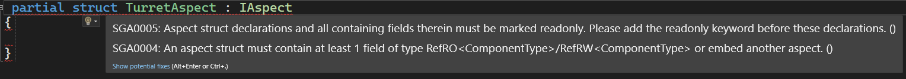

# DOTS Aspect即 IAspect类型的特点
这种类型可以把 开发者在处理某个Entity时相关的Component组合到一起，方便在访问的时候可以更便捷，节省代码空间。

关于它的机制，可以理解成，IAspect“定义了一个Archetype”，想要查询到这个“Archetype”就要满足它内部定义的所有Components的组合。
比如一个IAspect 里面有 Component A B C3种。 然后Entity1 有Component AC， Entity2有ComponentB，Entity3 有ABC。
只有Entity3会被找到。

要注意的是，如果用struct作为基础来定义一个IAspect类型，必须要用partial关键字修饰，且是 readonly。在其代码体内要至少有一个字段是 RefRO或RefRW标记的Component类型数据，或者内嵌另一个aspect。



示例代码：
```C#
// 定义IAspect类型的时候如果是struct作为基础那么必须要用partial关键字修饰
// 同时必须用readonly 修饰，并且在其代码体内，必须要有一个RefRO或者RefRW类型的数据
 readonly partial struct TurretAspect : IAspect
{
    // 定义一个RefRO标记的TurretComponent Component类型
    readonly RefRO<TurretComponent> a_Turret;

    // 定义了两个Entity并用上面定义的a_Turret内的两个 Entity值进行赋值
    
    public Entity CannonBallEntity => a_Turret.ValueRO.CannonBallprefab;
    public Entity CannonBallSpawnPoint => a_Turret.ValueRO.CannonBallSpawnPoint;

    // 至此，开发者就可以仅通过访问这个IAspect类型的数据直接获得 TurrentComponent 相关的数据了

    // 下面是一行测试代码，如果把这个类型定义在这个IAspect里面，而外面并没有任何实体具备这个Component
    // 这样Turret就不会发射炮弹了
    //readonly RefRO<TestAspectComponent> a_TestA;
}
```

# 在Query种使用IAspect
直接看代码示例：

```C#
[BurstCompile]
public partial struct TurretFiringSystem : ISystem
{
    [BurstCompile]
    public void OnUpdate(ref SystemState state)
    {
        // 在这里尝试使用IAspect类型，用刚定义的TurretAspect
        // 这里的Query查找的是具备 [TurretAspect里面定义的全部Components] 以及 [LocalToWorld Component]的entities
        foreach (var (turret, localToWorld) in SystemAPI.Query<TurretAspect,RefRO<LocalToWorld>>())
        {   
            //如果找到了，就利用EntityManager通过 TurretAspect里的CannonBallEntity值，实例化一个 CannonBall的entity出来
            Entity instance = state.EntityManager.Instantiate(turret.CannonBallEntity);
            // 为刚实例化出来的entity实例的LocalTransform Component数据进行赋值
            state.EntityManager.SetComponentData(instance, new LocalTransform
            {
                // 这里很有意思，是用“炮口”entity的LocalToWorld的Position的值，作为刚实例化出来的CannonBall的位置的值
                Position = SystemAPI.GetComponent<LocalToWorld>(turret.CannonBallSpawnPoint).Position,
                Rotation = quaternion.identity,
                // Scale还是自己的Scale
                Scale = SystemAPI.GetComponent<LocalTransform>(turret.CannonBallEntity).Scale
            });

            // 再给它的CannonBallComponent 数据进行设置
            state.EntityManager.SetComponentData(instance, new CannonBallComponent
            {
                speed = localToWorld.ValueRO.Up * 20f
            });
        }
    }
}
```
额外记录一下：
我从这段代码中看到，如果我们手动通过代码实例化Entity的话，在实例化出来之后需要使用EntityManager的SetComponent(Entity entity, ComponentType component) 给这个entity所需的Components的数据们进行设置。


## 附录：
CannonBall Component与它的Authoring和Baking
```C#
public struct CannonBallComponent : IComponentData
{
    public float3 speed;
}

// Authoring & Baking
public class CannonBallAuthoring : MonoBehaviour
{
}

public class CannonBallBaker : Baker<CannonBallAuthoring>
{
    public override void Bake(CannonBallAuthoring authoring)
    {
        AddComponent<CannonBallComponent>(GetEntity(TransformUsageFlags.Dynamic));
    }
}

```